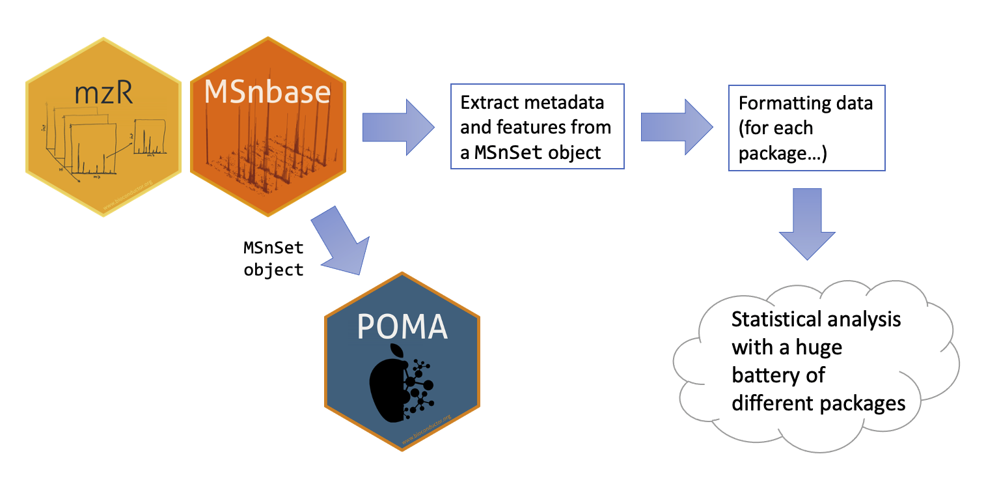
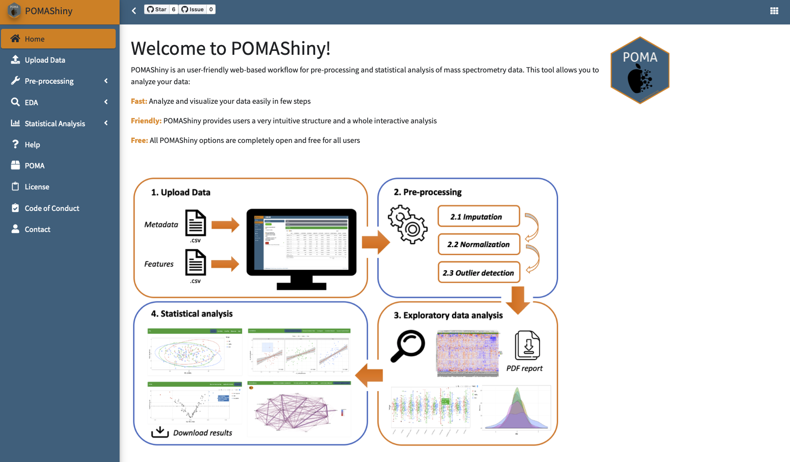

layout: true

<div class="my-header"></div>

<div class="my-footer"><span>
<a href="https://twitter.com/polcastellano_" style="color:white">@polcastellano_</a>
&emsp;&emsp;&emsp;&emsp;&emsp;&emsp;&emsp;&emsp;&emsp;&emsp;&emsp;&emsp;&emsp;&emsp;&emsp;&emsp;&emsp;
POMA
</span></div>

```{r setup, include = FALSE}
stopifnot(require(htmltools))
stopifnot(require(knitr))
```

```{r htmltools, include = FALSE}
htmltools::tagList(rmarkdown::html_dependency_font_awesome())
```

---

# Outline

.columnwide[
  ### 1) Scope of the package
  ### 2) POMA workflow (with examples)
  ### &emsp; 2.1) Data formatting
  ### &emsp; 2.2) Pre-processing
  ### &emsp; 2.3) Exploratory Data Analysis (EDA)
  ### &emsp; 2.4) Statistical Analysis
  ### 3) Next steps...
]

.columnnarrow[

<br>

]

---

# Scope of POMA

.center[
.textboxorange[`POMA` package focuses on <u>**statistical analysis**</u> of metabolomics and proteomics]
]

--

  1) Directly from sheet (xlsx, csv, etc.) &#10060;&#10060;
  
--
  
  2) Extracting quantitative data from `MSnbase::MSnSet` objects &#10060;

--

  3) Using `MSnbase::MSnSet` objects directly (++ reproducibility and interoperability) &#9989;

--

.center[

]

---

# POMA workflow: 1) Data formatting

.center[
.textboxorange[The input format required in all `POMA` functions in a `MSnbase::MSnSet` object]
]

.pull-left[

**Target or "_phenotype data_"**


]

.pull-right[

**Features or "_expression data_"**


]

<br>

```{r, eval = FALSE}
# create MSnSet object from target and features data frames
msnset_object <- PomaMSnSetClass(tatget = "target", features = "features")
```

---

# POMA workflow: 2) Pre-processing

.center[
.textboxorange[All `POMA` pre-processing methods return a pre-processed `MSnSet` object]
]

### 2.1) Missing value imputation

```{r, eval = FALSE}
msnset_object %>% 
  PomaImpute(ZerosAsNA = FALSE, # treat zeros as zeros instead of NAs
             RemoveNA = TRUE, cutoff = 20, # remove columns with >20% of NA
             method = "knn") # k-nearest neighbors (default)
```

--

### 2.2) Normalization

```{r, eval = FALSE}
msnset_object %>% 
  PomaNorm(method = "log_pareto") # log Pareto scaling (default)
```

---

# POMA workflow: 2) Pre-processing

### 2.3) Outlier detection and cleaning

.pull-left[

Detection:

```{r, eval = FALSE}
msnset_object %>% 
  {{PomaOutliers(do = "analyze")}}
```

Output:

```{r, echo = FALSE, warning = FALSE, comment = FALSE, message = FALSE, fig.height = 4}
library(POMA)
library(patchwork)
library(ggplot2)

poma_outliers <- st000284 %>% 
  PomaNorm() %>%
  PomaOutliers(do = "analyze")

poma_outliers$polygon_plot + theme(legend.position = "top") | poma_outliers$distance_boxplot + theme(legend.position = "top")
```

]

.pull-right[

Clean:

```{r, eval = FALSE}
msnset_object %>% 
  {{PomaOutliers(do = "clean")}}
```

Output:

A clean `MSnSet` object (without sample outliers)

]

---

# POMA workflow: 3) EDA

.center[
.textboxorange[Include several flexible visualization options such as boxplots, density plots, heatmaps, etc.]
]

### Boxplot examples:

.pull-left[

Display samples:

```{r, echo = FALSE, warning = FALSE, comment = FALSE, message = FALSE}
clean_object <- st000336 %>% 
  PomaImpute(method = "knn") %>%
  PomaNorm(method = "log_pareto")
```

```{r, warning = FALSE, comment = FALSE, message = FALSE, fig.height = 4}
clean_object %>%
  PomaBoxplots(group = "samples", #<<
               label_size = 5)
```

]

.pull-right[

Display features:

```{r, warning = FALSE, comment = FALSE, message = FALSE, fig.height = 4}
clean_object %>%
  PomaBoxplots(group = "features") #<<
```

]

---

# POMA workflow: 3) EDA

### Boxplot examples:

Display features of interest:

```{r, warning = FALSE, comment = FALSE, message = FALSE, fig.height = 4, fig.align = "center"}
clean_object %>%
  PomaBoxplots(group = "features",
               feature_name = c("isoleucine", "leucine", "lysine")) #<<
```

---

# POMA workflow: 4) Statistical analysis

#### Statistical methods covered by `POMA`:

--

  - **Univariate analysis:** T-test, ANOVA, ANCOVA, Wilcoxon test, and Kruskal Wallis

--

  - **Multivariate analysis:** PCA, PLS-DA, and sPLS-DA

--

  - **Cluster analysis:** _k_-means (clusters projected in a MDS plot)

--

  - **Limma:** Both designs with and without covariates (from `limma` _Bioconductor_ package)

--

  - **Correlation analysis:** Pairwise correlations, correlogram, network correlations and Gaussian Graphical Models

--

  - **Regularization methods:** LASSO, Ridge, and Elasticnet (**allow train/test split**)

--

  - **Random forest:** Classical Random forest algorithm (**allow train/test split**)

--

  - **Rank products:** From `RankProd` _Bioconductor_ package

--

  - **Odds ratios:** Based on a logistic regression model (two-group analysis)

---

# POMA workflow: 4) Statistical analysis

.center[
All `POMA` functions are focused on <u>**simplifying and compacting**</u> the analyses, grouping different methodologies of the same class within a single function instead of maintaining many "single purpose" functions
]

--

.pull-left[

**Univariate analysis: 1 function, 4 methods**

```{r, warning = FALSE, comment = FALSE, message = FALSE, eval = FALSE}
# parametric methods
clean_object %>% 
  PomaUnivariate(method="ttest")

clean_object %>% 
  PomaUnivariate(method="anova")

# non-parametric methods
clean_object %>% 
  PomaUnivariate(method="mann")

clean_object %>% 
  PomaUnivariate(method="kruskal")
```

]

--

.pull-right[

**Multivariate analysis: 1 function, 3 methods**

```{r, warning = FALSE, comment = FALSE, message = FALSE, eval = FALSE}
clean_object %>% 
  PomaMultivariate(method="pca")

clean_object %>% 
  PomaUnivariate(method="plsda")

clean_object %>% 
  PomaUnivariate(method="splsda")
```

]

--

If the method provides different tables and plots, then the output will be a list of all these objects

---

# POMA workflow: 4) Statistical analysis

## Predictive features

---

# POMA workflow: 4) Statistical analysis

**"Top-down" example: From raw data to _limma_ model adjusted for covariates**

```{r, echo = FALSE, warning = FALSE, comment = FALSE, message = FALSE}
poma_results <- st000284 %>% 
  PomaImpute(method = "knn") %>%
  PomaNorm(method = "log_pareto") %>% 
  PomaOutliers(do = "clean") %>%
  PomaLimma(contrast = "CRC-Polyp", covariates = TRUE)
```

```{r, warning = FALSE, comment = FALSE, message = FALSE, eval = FALSE}
raw_MSnSet_data %>% 
  PomaImpute(method = "knn") %>%
  PomaNorm(method = "log_pareto") %>% 
  PomaOutliers(do = "clean") %>%
  PomaLimma(contrast = "CRC-Polyp", covariates = TRUE)
```

```{r, echo = FALSE, warning = FALSE, comment = FALSE, message = FALSE}
kableExtra::kbl(poma_results[1:5 ,], booktabs = TRUE) %>%
  kableExtra::kable_styling(latex_options = c("striped", "scale_down"))
```

---

# POMA Shiny version

.center[

]

<a href="https://github.com/pcastellanoescuder/POMAShiny"><i class="fab fa-github"></i>&nbsp; https://github.com/pcastellanoescuder/POMAShiny</a>
<br>
<a href="https://webapps.nutrimetabolomics.com/POMAShiny"><i class="fas fa-link"></i>&nbsp; https://webapps.nutrimetabolomics.com/POMAShiny</a>
---

# Next steps...

  - Implementation of more functions and methods focusing mainly on multivariate approaches

--

  - Explore the feasibility of a new _Bioconductor_ class to store the statistical analysis results, or extend an existing _Bioconductor_ class for this purpose (community feedback and collaborations are indispensable)
  
--

  - Gradually migrate the `MSnbase::MSnSet` structures used by `POMA` to the `QFeatures` structures for mass spectrometry assays included in `QFeatures` package
  
---

class: inverse, center, middle

<div class="my-footer"></div>

# Thank you all and welcome to contribute!

**[Statistics and Bioinformatics Research Group](https://sites.google.com/view/estbioinfo/home)** <span style="color:#ffffff">and</span> **[Biomarkers and Nutritional & Food Metabolomics Research Group](http://www.nutrimetabolomics.com/)** <span style="color:#ffffff">from</span> **[University of Barcelona](https://www.ub.edu/web/ub/en/index.html?)**      

<span style="color:#ffffff">Slides available at</span> [https://github.com/pcastellanoescuder/POMA_slides_EuroBioc2020](https://github.com/pcastellanoescuder/POMA_slides_EuroBioc2020)

<html><div style='float:left'></div><hr color='#f38620' size=1px width=720px></html> 

<a href="mailto:polcaes@gmail.com"><i class="fas fa-envelope"></i>&nbsp; polcaes@gmail.com</a><br>
<a href="https://pcastellanoescuder.github.io/"><i class="fas fa-link"></i>&nbsp; pcastellanoescuder.github.io</a><br>
<a href="http://twitter.com/polcastellano_"><i class="fab fa-twitter"></i>&nbsp; @polcastellano_</a><br>
<a href="https://github.com/pcastellanoescuder"><i class="fab fa-github"></i>&nbsp; @pcastellanoescuder</a><br>
<a href="https://www.ub.edu/web/ub/en/index.html?"><i class="fas fa-map-marker-alt"></i>&nbsp; University of Barcelona</a>

